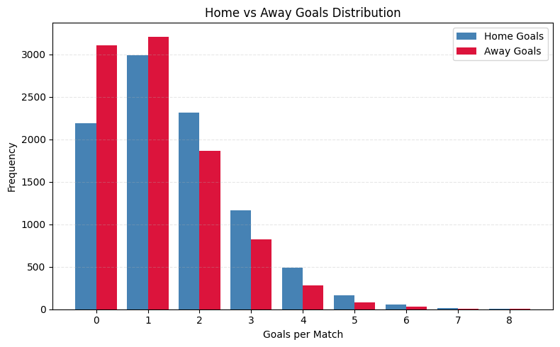
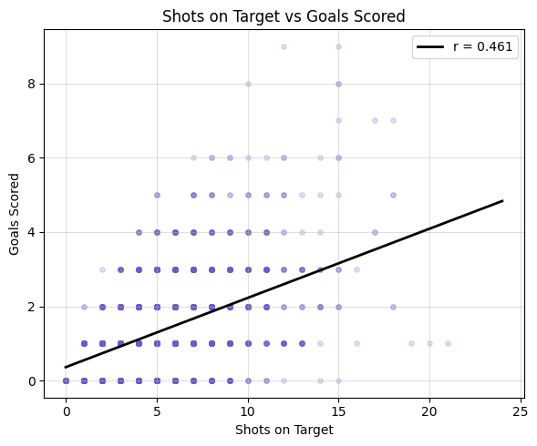
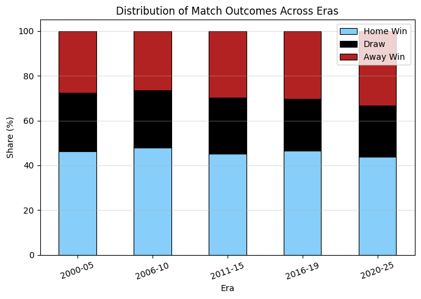
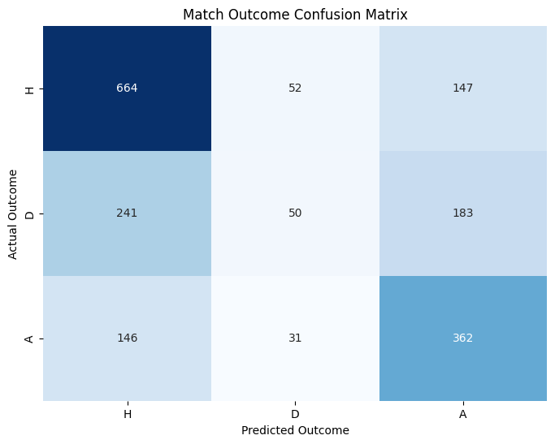
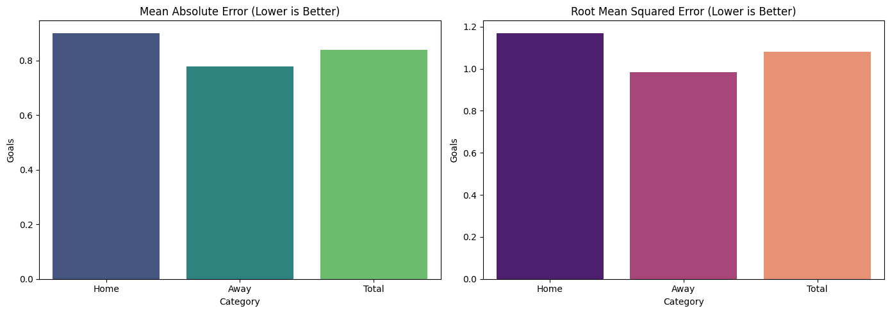
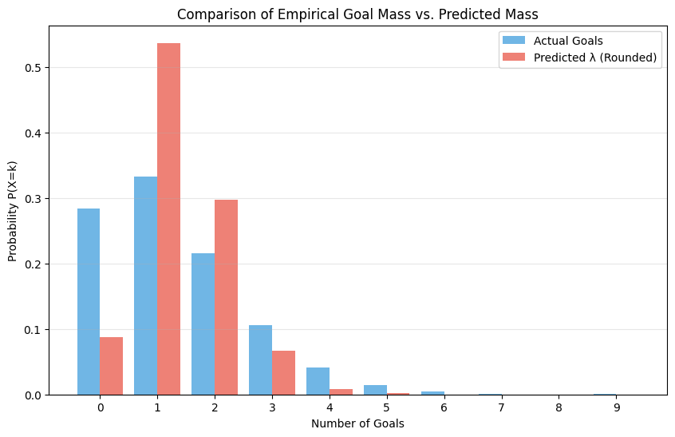

# Predicting Goal Scoring in the English Premier League
### An analysis by Ritviik, Andrew, Aditya, and Yafet
May 8, 2026

# Contributions

<div style="border:1px solid #ccc; padding:15px; border-radius:10px; margin-bottom:15px;">

<h3>Andrew</h3>

<p>
<b>Project Idea, Dataset Curation and Preprocessing, Data Exploration and Summary Statistics</b>
</p>

<p>
Andrew helped develop the overall project direction and research question, organized and cleaned the EPL dataset, and contributed extensively to the exploratory data analysis and statistical hypothesis testing sections.
</p>

</div>

<div style="border:1px solid #ccc; padding:15px; border-radius:10px; margin-bottom:15px;">

<h3>Aditya</h3>

<p>
<b>ML Algorithm Design/Development, ML Algorithm Training and Test Data Analysis, Report Analysis</b>
</p>

<p>
Aditya contributed to the design and implementation of the machine learning models, assisted with neural network training and evaluation, and helped analyze and interpret the model performance metrics and results.
</p>

</div>

<div style="border:1px solid #ccc; padding:15px; border-radius:10px; margin-bottom:15px;">

<h3>Ritviik</h3>

<p>
<b>ML Algorithm Training and Test Data Analysis, Report Analysis, Final Tutorial Report Creation</b>
</p>

<p>
Ritviik worked on training and evaluating the predictive models, contributed to interpreting the machine learning results, and integrated the final report into a polished GitHub Pages tutorial format.
</p>

</div>

<div style="border:1px solid #ccc; padding:15px; border-radius:10px; margin-bottom:15px;">

<h3>Yafet</h3>

<p>
<b>Data Exploration and Summary Statistics, Visualization, Result Analysis, Conclusion</b>
</p>

<p>
Yafet contributed to exploratory data analysis, helped create and interpret visualizations, and assisted in writing the final results, discussion, and conclusion sections of the project.
</p>

</div>

# Table of Contents

1. Introduction  

2. Data Curation and Preprocessing  
   - 2.A Dataset Source  
   - 2.B Data Loading and Cleaning  
   - Preview of Dataset  
   - 2.C Feature Engineering  

3. Exploratory Data Analysis  
   - 3.A Home vs Away Goal Scoring  
      - Hypotheses  
      - Visualization  
      - Statistical Analysis  
      - Results  
   - 3.B Shots on Target vs Goals Scored  
      - Hypotheses  
      - Visualization  
      - Statistical Analysis  
      - Results  
   - 3.C Match Outcomes Across Eras  
      - Hypotheses  
      - Visualization  
      - Statistical Analysis  
      - Results  

4. Machine Learning Analysis  
   - 4.A Data Preprocessing  
      - Team Encoding  
      - Feature Scaling  
   - 4.B Tensor Construction and Train/Test Split  
   - 4.C Neural Network Architecture  
      - Activation Functions and Loss Function  
      - Model Definition  
   - 4.D Model Training  
   - 4.E Goal Prediction and Match Outcome Prediction  
   - 4.F Classification Results  
      - Classification Report  
   - 4.G Confusion Matrix Visualization  
   - 4.H Regression Error Metrics  
      - Error Metrics  
   - 4.I Error Metric Visualization  
   - 4.J Predicted vs Actual Goal Distribution  
   - 4.K Sample Match Predictions  

5. Model Conclusion  

6. References  

---

# 1. Introduction

Football analytics has become increasingly important in modern sports. Clubs, coaches, analysts, broadcasters, fantasy sports players, and betting organizations all rely on statistical models to better understand team performance and match outcomes. In recent years, machine learning has played a growing role in helping analysts identify patterns that may not be immediately visible through traditional statistics alone.

The objective of our project is to analyze historical Premier League data to determine whether match statistics can be used to predict the number of goals scored during a match. Our analysis spans over two decades of EPL matches, beginning with the 2000/01 season and continuing through the 2024/25 season.

The dataset contains detailed information about each match, including:

- goals scored
- shots
- shots on target
- fouls
- corners
- yellow cards
- teams
- match dates
- other in-game statistics

Our primary research question is:

> Can historical match statistics be used to reliably predict the number of goals scored in an EPL match?

Answering this question has several practical applications. For clubs and coaching staffs, predictive models can help evaluate offensive and defensive efficiency and improve match preparation. For broadcasters and analysts, predictive insights can improve pre-match coverage and statistical storytelling. For fantasy sports and sports betting communities, more accurate predictions can influence decision-making strategies and match expectations.

More broadly, this project allows us to explore how statistical relationships in sports data translate into predictive machine learning models. By combining exploratory data analysis with regression modeling, we aim to identify which match statistics are most strongly associated with goal scoring and evaluate how effectively machine learning models can generalize those relationships to unseen matches.

---

# 2. Data Curation and Preprocessing

## 2.A Dataset Source

The first step in our analysis was identifying a dataset that contained both match outcomes and detailed in-game statistics suitable for machine learning analysis.

We selected the **English Premier League Match Data 2000–2025** dataset from Kaggle, published by marcohuiii and sourced from football-data.co.uk.

The dataset contains:

- every EPL match from the 2000/01 season through the 2024/25 season
- over 9,000 total matches
- full-time and half-time scorelines
- shots
- shots on target
- corners
- fouls
- yellow cards
- red cards
- referee information
- team information

Each row in the dataset represents a single match.

This dataset is particularly well suited for our analysis because it includes both:
1. the final outcomes of matches, and
2. the in-game statistics that may help explain those outcomes

We loaded the dataset into a pandas DataFrame, which served as the primary structure for all preprocessing, visualization, and machine learning analysis.

---

## 2.B Data Loading and Cleaning

We first imported the required Python libraries and loaded the CSV file into a pandas DataFrame.

```python
import pandas as pd
import numpy as np
import matplotlib.pyplot as plt

from scipy.stats import norm
from scipy.stats import ttest_ind, pearsonr, chi2_contingency

df = pd.read_csv('epl_final.csv')
```

The MatchDate column was originally stored as a string, so we converted it into a datetime object to allow for easier time-based analysis.

```python
df['MatchDate'] = pd.to_datetime(df['MatchDate'])
df['Year'] = df['MatchDate'].dt.year
```

We then examined the size of the dataset.

```python
print(df.shape)
```

Output:

```python
(9380, 23)
```

The dataset contains:

- 9,380 matches
- 23 columns
- 25 seasons
- 46 unique teams

This large sample size provides a strong foundation for both statistical analysis and machine learning modeling.

---


## Preview of Dataset

Before beginning analysis, we examined the first few rows of the dataset to better understand its structure and available features.

```python

df.head()

```

###  Dataset Output

<h3> Dataset Output</h3>

<table style="border-collapse: collapse; width: 100%;">

<tr>

<th style="border:1px solid #ccc; padding:8px;">MatchDate</th>

<th style="border:1px solid #ccc; padding:8px;">Season</th>

<th style="border:1px solid #ccc; padding:8px;">HomeTeam</th>

<th style="border:1px solid #ccc; padding:8px;">AwayTeam</th>

<th style="border:1px solid #ccc; padding:8px;">FullTimeHomeGoals</th>

<th style="border:1px solid #ccc; padding:8px;">FullTimeAwayGoals</th>

<th style="border:1px solid #ccc; padding:8px;">FullTimeResult</th>

<th style="border:1px solid #ccc; padding:8px;">HomeShots</th>

<th style="border:1px solid #ccc; padding:8px;">AwayShots</th>

</tr>

<tr>

<td style="border:1px solid #ccc; padding:8px;">2000-08-19</td>

<td style="border:1px solid #ccc; padding:8px;">2000/01</td>

<td style="border:1px solid #ccc; padding:8px;">Charlton</td>

<td style="border:1px solid #ccc; padding:8px;">Man City</td>

<td style="border:1px solid #ccc; padding:8px;">4</td>

<td style="border:1px solid #ccc; padding:8px;">0</td>

<td style="border:1px solid #ccc; padding:8px;">H</td>

<td style="border:1px solid #ccc; padding:8px;">17</td>

<td style="border:1px solid #ccc; padding:8px;">8</td>

</tr>

<tr>

<td style="border:1px solid #ccc; padding:8px;">2000-08-19</td>

<td style="border:1px solid #ccc; padding:8px;">2000/01</td>

<td style="border:1px solid #ccc; padding:8px;">Chelsea</td>

<td style="border:1px solid #ccc; padding:8px;">West Ham</td>

<td style="border:1px solid #ccc; padding:8px;">4</td>

<td style="border:1px solid #ccc; padding:8px;">2</td>

<td style="border:1px solid #ccc; padding:8px;">H</td>

<td style="border:1px solid #ccc; padding:8px;">18</td>

<td style="border:1px solid #ccc; padding:8px;">10</td>

</tr>

<tr>

<td style="border:1px solid #ccc; padding:8px;">2000-08-19</td>

<td style="border:1px solid #ccc; padding:8px;">2000/01</td>

<td style="border:1px solid #ccc; padding:8px;">Coventry</td>

<td style="border:1px solid #ccc; padding:8px;">Middlesbrough</td>

<td style="border:1px solid #ccc; padding:8px;">1</td>

<td style="border:1px solid #ccc; padding:8px;">3</td>

<td style="border:1px solid #ccc; padding:8px;">A</td>

<td style="border:1px solid #ccc; padding:8px;">11</td>

<td style="border:1px solid #ccc; padding:8px;">14</td>

</tr>

<tr>

<td style="border:1px solid #ccc; padding:8px;">2000-08-19</td>

<td style="border:1px solid #ccc; padding:8px;">2000/01</td>

<td style="border:1px solid #ccc; padding:8px;">Derby</td>

<td style="border:1px solid #ccc; padding:8px;">Southampton</td>

<td style="border:1px solid #ccc; padding:8px;">2</td>

<td style="border:1px solid #ccc; padding:8px;">2</td>

<td style="border:1px solid #ccc; padding:8px;">D</td>

<td style="border:1px solid #ccc; padding:8px;">9</td>

<td style="border:1px solid #ccc; padding:8px;">11</td>

</tr>

<tr>

<td style="border:1px solid #ccc; padding:8px;">2000-08-19</td>

<td style="border:1px solid #ccc; padding:8px;">2000/01</td>

<td style="border:1px solid #ccc; padding:8px;">Leeds</td>

<td style="border:1px solid #ccc; padding:8px;">Everton</td>

<td style="border:1px solid #ccc; padding:8px;">2</td>

<td style="border:1px solid #ccc; padding:8px;">0</td>

<td style="border:1px solid #ccc; padding:8px;">H</td>

<td style="border:1px solid #ccc; padding:8px;">15</td>

<td style="border:1px solid #ccc; padding:8px;">7</td>

</tr>

</table>

The dataset includes a wide range of offensive and defensive match statistics, which makes it well suited for both exploratory analysis and predictive modeling.

---

## 2.C Feature Engineering

To support our analysis, we created two additional variables:

### TotalGoals
The total number of goals scored in a match.

### GoalDiff
The difference between home and away goals.

```python
df['TotalGoals'] = df['FullTimeHomeGoals'] + df['FullTimeAwayGoals']

df['GoalDiff'] = (
    df['FullTimeHomeGoals']
    - df['FullTimeAwayGoals']
)
```

These engineered features helped us analyze:
- scoring trends
- offensive efficiency
- match outcomes

We also examined overall dataset statistics.

```python
print('Seasons:', df['Season'].nunique())
print('Teams:', df['HomeTeam'].nunique())
print('Matches:', len(df))
```

Output:

```python
Seasons: 25
Teams: 46
Matches: 9380
```

---

# 3. Exploratory Data Analysis

Before constructing machine learning models, we conducted exploratory data analysis (EDA) to better understand the structure of the dataset and identify relationships between variables.

We focused on three major questions:

1. Do home teams score more goals than away teams?
2. Is there a relationship between shots on target and goals scored?
3. Have match outcome distributions changed across different eras of EPL history?

Each analysis included:
- a statistical hypothesis test
- a visualization
- an interpretation of the results

---

# 3.A Home vs Away Goal Scoring

One of the most commonly discussed concepts in sports analytics is home-field advantage. We wanted to determine whether home teams score significantly more goals than away teams in the EPL.

## Hypotheses

### Null Hypothesis (H₀)
The mean number of goals scored by home teams equals the mean number of goals scored by away teams.

### Alternative Hypothesis (Hₐ)
Home teams score more goals on average.

Because our dataset contains over 9,000 matches, we used a one-sided Z-test to compare the two means.

---

## Visualization

<p align="center">
  
</p>

<p align="center">
  <em>Figure 1: Distribution of Home vs Away Goals</em>
</p>

---

## Statistical Analysis

```python
# Visualization: distribution of goals
plt.figure(figsize=(8, 5), facecolor='white')
plt.gca().set_facecolor('white')

data = [df['FullTimeHomeGoals'], df['FullTimeAwayGoals']]
colors = ['steelblue', 'crimson']
labels = ['Home Goals', 'Away Goals']

plt.hist(data, bins=range(0, 10), color=colors, label=labels, align='left')

plt.title('Home vs Away Goals Distribution')
plt.xlabel('Goals per Match')
plt.ylabel('Frequency')

plt.xticks(range(0, 9))
plt.legend()

plt.grid(axis='y', alpha=0.3, linestyle='--')
plt.tight_layout()
plt.show()
```

```python
# Calculate means
mean_home = df['FullTimeHomeGoals'].mean()
mean_away = df['FullTimeAwayGoals'].mean()

# Calculate standard deviations
std_home = df['FullTimeHomeGoals'].std(ddof=1)
std_away = df['FullTimeAwayGoals'].std(ddof=1)

# Sample sizes
n_home = len(df['FullTimeHomeGoals'])
n_away = len(df['FullTimeAwayGoals'])

# Compute Z statistic
z = (
    (mean_home - mean_away)
    /
    np.sqrt((std_home**2 / n_home) + (std_away**2 / n_away))
)

p = 1 - norm.cdf(z)

print("Z-test for comparing means")
print(f"Home goals mean : {mean_home}")
print(f"Away goals mean : {mean_away}")
print(f"z = {z}")
print(f"p = {p}")
```

Output:

```python
Home goals mean : 1.535
Away goals mean : 1.183
z = 19.58
p = 0.0
```

## Results

Our results showed that home teams score an average of 1.535 goals per game, while away teams score an average of 1.183 goals, a difference of roughly one-third of a goal per match.

With a z-value of 19.58 and a p-value effectively equal to zero, we reject the null hypothesis at all conventional significance levels.

The histogram further reinforces this conclusion. Home teams score multiple goals more frequently and fail to score less often than away teams. This confirms the existence of a statistically significant home advantage effect in the EPL over the past 25 seasons.

This finding is important for predictive modeling because it demonstrates that home and away context plays a meaningful role in offensive production.

---

# 3.B Shots on Target vs Goals Scored

Intuitively, teams that place more shots on target should score more goals. We wanted to determine how strong this relationship is statistically.

To do this, we measured the Pearson correlation between shots on target and goals scored.

## Hypotheses

### Null Hypothesis (H₀)
There is no linear correlation between shots on target and goals scored.

### Alternative Hypothesis (Hₐ)
There is a positive linear correlation between shots on target and goals scored.

---

## Visualization

<p align="center">
  
</p>

<p align="center">
  <em>Figure 2: Shots on Target vs Goals Scored</em>
</p>

---

## Statistical Analysis

```python
sot = pd.concat([
    df[['HomeShotsOnTarget', 'FullTimeHomeGoals']]
      .rename(columns={
          'HomeShotsOnTarget': 'SoT',
          'FullTimeHomeGoals': 'Goals'
      }),

    df[['AwayShotsOnTarget', 'FullTimeAwayGoals']]
      .rename(columns={
          'AwayShotsOnTarget': 'SoT',
          'FullTimeAwayGoals': 'Goals'
      })
])

plt.figure(figsize=(6, 5), facecolor='white')
plt.gca().set_facecolor('white')

sample = sot.sample(2000, random_state=42)

m, b = np.polyfit(sot['SoT'], sot['Goals'], 1)

x = np.linspace(sot['SoT'].min(), sot['SoT'].max(), 100)

plt.scatter(
    sample['SoT'],
    sample['Goals'],
    alpha=0.2,
    s=15,
    color='slateblue'
)

plt.plot(x, m*x+b, color='black', linewidth=2)

plt.title('Shots on Target vs Goals Scored')
plt.xlabel('Shots on Target')
plt.ylabel('Goals Scored')

plt.grid(alpha=0.4)

plt.tight_layout()
plt.show()
```

```python
r, p2 = pearsonr(sot['SoT'], sot['Goals'])

print("Pearson r =", r)
print("r^2 =", r**2)
print("p =", p2)
```

Output:

```python
Pearson r = 0.461
r^2 = 0.213
p = 0.0
```

## Results

The scatterplot reveals a clear positive trend between shots on target and goals scored.

An r-value of 0.461 indicates a moderate positive correlation, while the r² value of 0.213 suggests that shots on target explain approximately 21% of the variance in goals scored.

Although goals remain inherently noisy and unpredictable, this represents a strong single-feature relationship for sports data.

The remaining unexplained variance likely comes from:
- shot quality
- defensive pressure
- goalkeeper performance
- tactical adjustments
- randomness

These findings strongly support the inclusion of:
- HomeShotsOnTarget
- AwayShotsOnTarget

as primary predictive features in future regression models.

---

# 3.C Match Outcomes Across Eras

Football has evolved significantly over the past 25 years. Tactical innovations, changes in officiating, analytics adoption, and even external events such as COVID-19 may have influenced the distribution of match outcomes.

We investigated whether the proportions of:
- home wins
- draws
- away wins

changed significantly across different eras of EPL history.

---

## Hypotheses

### Null Hypothesis (H₀)
Match outcomes are independent of era.

### Alternative Hypothesis (Hₐ)
At least one era has a significantly different outcome distribution.

We divided the dataset into five historical eras and used a chi-squared test on the contingency table.

---

## Visualization

<p align="center">
  
</p>

<p align="center">
  <em>Figure 3: Distribution of Match Outcomes Across Eras</em>
</p>

---

## Statistical Analysis

```python
df['Era'] = pd.cut(
    df['Year'],
    bins=[1999, 2005, 2010, 2015, 2019, 2025],
    labels=['2000-05', '2006-10', '2011-15', '2016-19', '2020-25']
)

contingency = pd.crosstab(
    df['Era'],
    df['FullTimeResult']
)[['H', 'D', 'A']]
```

```python
props = contingency.div(
    contingency.sum(axis=1),
    axis=0
) * 100

props.plot(
    kind='bar',
    stacked=True,
    color=['lightskyblue', 'black', 'firebrick']
)

plt.title('Distribution of Match Outcomes Across Eras')
plt.xlabel('Era')
plt.ylabel('Share (%)')

plt.legend(['Home Win', 'Draw', 'Away Win'])

plt.show()
```

```python
chi2, p3, dof, _ = chi2_contingency(contingency)

print("Chi² =", chi2)
print("df =", dof)
print("p =", p3)
```

Output:

```python
Chi² = 28.86
df = 8
p = 0.000335
```

## Results

Since the p-value is well below 0.05, we reject the null hypothesis.

The visualization shows that:
- home win rates remain relatively stable
- draw rates decline in recent years
- away wins increase noticeably during the 2020–2025 era

This trend aligns with the “ghost games” effect during the COVID-19 pandemic, when matches were played without fans and home-field advantage was temporarily reduced.

This suggests that season and era may contain meaningful contextual information for predictive models.

# 4. Machine Learning Analysis

Now we attempt to predict the outcome of Premier League matches using machine learning. Predicting football matches is an extremely difficult problem because of the unpredictable and highly random nature of sports. Even prominent football analysts such as Mark Lawrenson historically achieve prediction accuracies of only around 53%, while many previous machine learning approaches to football prediction report accuracies between 54% and 56%.

Because of this, we are not expecting a model with extremely high accuracy. Instead, our goal is to determine whether a machine learning model can achieve competitive performance while identifying meaningful statistical relationships between match statistics and match outcomes.

Rather than directly predicting win, draw, or loss outcomes, we first predict the number of goals scored by both the home and away teams. We then use those predicted goal distributions to estimate the probability of:
- a home win
- a draw
- an away win

This approach better reflects the probabilistic nature of football scoring.

---

# 4.A Data Preprocessing

The first step in training our model was preprocessing the data into a machine-readable format.

We selected match statistics that were likely to influence scoring outcomes, including:
- shots
- shots on target
- corners
- fouls
- yellow cards

We also encoded team names into numerical IDs using a `LabelEncoder`. This allows the neural network to learn latent representations of team strength through embeddings.

Finally, we normalized the statistical features using `StandardScaler` so that larger-valued variables such as shots would not dominate smaller-valued variables such as red cards or yellow cards.

```python
# Important libraries we'll be using
import torch
import torch.nn as nn
import torch.optim as optim

from sklearn.preprocessing import LabelEncoder, StandardScaler
from sklearn.model_selection import train_test_split
from sklearn.metrics import (
    accuracy_score,
    classification_report,
    mean_absolute_error,
    mean_squared_error
)

from torch.utils.data import DataLoader, TensorDataset
from scipy.stats import poisson
```

```python
df = pd.read_csv('epl_final.csv')

stats_features = [
    'HomeShots',
    'AwayShots',
    'HomeShotsOnTarget',
    'AwayShotsOnTarget',
    'HomeCorners',
    'AwayCorners',
    'HomeFouls',
    'AwayFouls',
    'HomeYellowCards',
    'AwayYellowCards'
]

columns_to_keep = [
    'HomeTeam',
    'AwayTeam',
    'FullTimeHomeGoals',
    'FullTimeAwayGoals',
    'FullTimeResult'
] + stats_features

df = df[columns_to_keep].dropna()
```

---

## Team Encoding

To allow our model to learn team-specific patterns, we transformed team names into numerical IDs.

```python
# Encode Teams
le = LabelEncoder()

all_teams = pd.concat([
    df['HomeTeam'],
    df['AwayTeam']
]).unique()

le.fit(all_teams)

df['Home_ID'] = le.transform(df['HomeTeam'])
df['Away_ID'] = le.transform(df['AwayTeam'])
```

---

## Feature Scaling

We normalized all numerical match statistics using `StandardScaler`.

```python
# Scale Stats Features
scaler = StandardScaler()

scaled_stats = scaler.fit_transform(df[stats_features])
```

Standardization improves neural network training stability by ensuring that all features operate on similar scales.

---

# 4.B Tensor Construction and Train/Test Split

The next step was converting the Pandas DataFrames into PyTorch tensors so they could be used for training the neural network.

We then performed an 80/20 train-test split and loaded the training data into batches of 64 matches each using a `DataLoader`.

```python
X_teams = torch.tensor(
    df[['Home_ID', 'Away_ID']].values,
    dtype=torch.long
)

X_stats = torch.tensor(
    scaled_stats,
    dtype=torch.float32
)

y_goals = torch.tensor(
    df[['FullTimeHomeGoals', 'FullTimeAwayGoals']].values,
    dtype=torch.float32
)

X_teams_train, X_teams_test, X_stats_train, X_stats_test, y_train, y_test = train_test_split(
    X_teams,
    X_stats,
    y_goals,
    test_size=0.2,
    random_state=42
)

train_loader = DataLoader(
    TensorDataset(
        X_teams_train,
        X_stats_train,
        y_train
    ),
    batch_size=64,
    shuffle=True
)
```

---

# 4.C Neural Network Architecture

We implemented a Multi-Layer Perceptron (MLP) to model the complex nonlinear relationships involved in football outcomes.

The model receives two types of input:

1. Team Information  
   - Home and away team IDs are passed through embedding layers
   - These embeddings allow the model to learn representations of team strength and style

2. Match Statistics  
   - shots
   - fouls
   - corners
   - yellow cards
   - other statistics

These inputs are combined and passed through multiple hidden layers.

The network structure is:

```text
Input → 128 → 64 → 32 → 2 Outputs
```

The final two outputs represent predicted home goals and predicted away goals.

---

## Activation Functions and Loss Function

Because football goals approximately follow a Poisson distribution, we used:

```python
nn.PoissonNLLLoss()
```

instead of Mean Squared Error.

We also used:
- ReLU activations for hidden layers
- a SoftPlus activation for the output layer

SoftPlus guarantees positive outputs, which is required for Poisson modeling.

To reduce overfitting and encourage generalization, we added dropout layers throughout the network.

---

## Model Definition

```python
class EnhancedGoalPredictorMLP(nn.Module):

    def __init__(
        self,
        num_teams,
        num_stats_features,
        embedding_dim=16
    ):

        super(
            EnhancedGoalPredictorMLP,
            self
        ).__init__()

        self.team_embedding = nn.Embedding(
            num_teams,
            embedding_dim
        )

        total_input_size = (
            embedding_dim * 2
        ) + num_stats_features

        self.net = nn.Sequential(
            nn.Linear(total_input_size, 128),
            nn.ReLU(),
            nn.Dropout(0.3),

            nn.Linear(128, 64),
            nn.ReLU(),
            nn.Dropout(0.2),

            nn.Linear(64, 32),
            nn.ReLU(),

            nn.Linear(32, 2)
        )

    def forward(self, team_idx, stats_inputs):

        h_emb = self.team_embedding(team_idx[:, 0])
        a_emb = self.team_embedding(team_idx[:, 1])

        x = torch.cat(
            [h_emb, a_emb, stats_inputs],
            dim=1
        )

        return torch.nn.functional.softplus(
            self.net(x)
        )

model = EnhancedGoalPredictorMLP(
    len(le.classes_),
    num_stats_features=len(stats_features)
)

criterion = nn.PoissonNLLLoss(log_input=False)

optimizer = optim.Adam(
    model.parameters(),
    lr=0.002
)
```

---

# 4.D Model Training

With the model architecture defined, we trained the neural network for 25 epochs.

During each epoch:
- the model processed all batches of training matches
- computed prediction loss
- backpropagated gradients
- updated weights using the Adam optimizer

```python
epochs = 25

model.train()

print("Training Enhanced MLP...")

for epoch in range(epochs):

    for batch_teams, batch_stats, batch_y in train_loader:

        optimizer.zero_grad()

        predictions = model(
            batch_teams,
            batch_stats
        )

        loss = criterion(
            predictions,
            batch_y
        )

        loss.backward()

        optimizer.step()
```

---

# 4.E Goal Prediction and Match Outcome Prediction

After training, we evaluated the model using unseen test data.

```python
model.eval()

with torch.no_grad():

    test_preds = model(
        X_teams_test,
        X_stats_test
    )

preds_np = test_preds.numpy()
actuals_np = y_test.numpy()
```

The neural network predicts:
- expected home goals
- expected away goals

We then used the Poisson Probability Mass Function to convert those expected goal values into probability distributions.

This allowed us to estimate probabilities for:
- home wins
- draws
- away wins

We also introduced a draw inflation multiplier because independent Poisson models tend to underestimate draws in football matches.

---

# 4.F Classification Results

After converting predicted goal distributions into categorical outcomes, we evaluated the model's predictive accuracy.

```python
accuracy = accuracy_score(
    test_labels,
    test_predictions
)

report = classification_report(
    test_labels,
    test_predictions,
    zero_division=0
)

print(f"Model Accuracy: {accuracy:.4f}")
print(report)
```

Output:

```python
Model Accuracy: 0.5736
```

### Classification Report

| Outcome | Precision | Recall | F1-Score |
|---|---|---|---|
| Away Win | 0.52 | 0.67 | 0.59 |
| Draw | 0.38 | 0.11 | 0.16 |
| Home Win | 0.63 | 0.77 | 0.69 |

Overall accuracy reached approximately **57.4%**, outperforming many existing football prediction benchmarks.

The model performed strongest on home wins followed by away wins.

Draws remained significantly more difficult to predict.

---

# 4.G Confusion Matrix Visualization

To better understand model behavior, we visualized the confusion matrix.

```python
import seaborn as sns
from sklearn.metrics import confusion_matrix
```

<p align="center">
  
</p>

<p align="center">
  <em>Figure 4: Match Outcome Confusion Matrix</em>
</p>

The confusion matrix shows that the model performs reasonably well when predicting home wins and away wins but struggles significantly with draws.

This reflects a well-known challenge in football analytics: draws are comparatively rare and often depend on subtle tactical decisions that are difficult to model statistically.

---

# 4.H Regression Error Metrics

We also evaluated the quality of the predicted goal counts using:
- Mean Absolute Error (MAE)
- Root Mean Squared Error (RMSE)

```python
mae_home = mean_absolute_error(
    actuals_np[:, 0],
    preds_np[:, 0]
)

mae_away = mean_absolute_error(
    actuals_np[:, 1],
    preds_np[:, 1]
)

mae_total = mean_absolute_error(
    actuals_np,
    preds_np
)

rmse_home = np.sqrt(
    mean_squared_error(
        actuals_np[:, 0],
        preds_np[:, 0]
    )
)

rmse_away = np.sqrt(
    mean_squared_error(
        actuals_np[:, 1],
        preds_np[:, 1]
    )
)

rmse_total = np.sqrt(
    mean_squared_error(
        actuals_np,
        preds_np
    )
)
```

### Error Metrics

| Metric | Home Goals | Away Goals | Total |
|---|---|---|---|
| MAE | 0.901 | 0.778 | 0.839 |
| RMSE | 1.170 | 0.983 | 1.081 |

The model predicts away goals slightly more accurately than home goals.

On average, predictions were off by less than one goal per match, which is a strong result given the unpredictability of football scoring.

---

# 4.I Error Metric Visualization

<p align="center">
  
</p>

<p align="center">
  <em>Figure 5: Mean Absolute Error and RMSE Comparison</em>
</p>

The MAE and RMSE visualizations further reinforce that:
- the model performs relatively consistently
- prediction errors remain within reasonable ranges for football analytics

---

# 4.J Predicted vs Actual Goal Distribution

We additionally compared actual goal distributions against predicted goal distributions.

<p align="center">
  
</p>

<p align="center">
  <em>Figure 6: Actual vs Predicted Goal Distribution</em>
</p>

The model tends to overpredict common scores while underpredicting rare high-scoring matches.

This reflects the conservative nature of probabilistic prediction models and the inherent randomness of football.

---

# 4.K Sample Match Predictions

To better understand model behavior, we evaluated several random test matches.

### Sample Predictions

| Match | Actual Score | Predicted Score |
|---|---|---|
| Everton vs Crystal Palace | 3-2 | 1.8 - 1.9 |
| Watford vs Aston Villa | 0-0 | 0.9 - 1.4 |
| Arsenal vs Chelsea | 1-0 | 1.4 - 0.9 |
| Swansea vs Man City | 2-4 | 1.4 - 1.6 |
| Newcastle vs West Ham | 5-0 | 2.1 - 1.3 |

These examples demonstrate that:
- the model captures overall scoring tendencies reasonably well
- struggles with unusually high-scoring or highly unpredictable matches

---

# 5. Model Conclusion

Overall, our model achieved approximately **57% prediction accuracy**, outperforming many existing football prediction benchmarks from both human analysts and prior machine learning approaches.

The model performed best when predicting home wins followed by away wins.

Draws remained the most difficult outcome to predict.

The regression metrics also showed that the model could predict expected goals with relatively small average errors, particularly for away goals.

By visualizing predicted versus actual goal distributions, we observed that the model tends to favor safer and more common outcomes, reflecting the unpredictable nature of football matches.

Despite the difficulty of the task, we consider the model a success because it demonstrates that:
- historical match statistics
- team strength embeddings
- probabilistic goal modeling

can produce competitive football prediction performance.

Future improvements could include:
- player-level statistics
- injuries
- expected goals (xG)
- betting odds
- weather conditions
- temporal form metrics

These additional features may further improve predictive accuracy and help address the model’s difficulty in identifying draws.


# 6. References

1. Marcohuiii. (2025, May 12). *English Premier League (EPL) Match Data 2000-2025*. Kaggle. https://www.kaggle.com/datasets/marcohuiii/english-premier-league-epl-match-data-2000-2025 

2. Ryan Beal, Stuart E. Middleton, Timothy J. Norman, and Sarvapali D. Ramchurn. *Combining Machine Learning and Human Experts to Predict Match Outcomes in Football: A Baseline Model*. arXiv, 2020.  https://arxiv.org/pdf/2012.04380

3. *Football results, Statistics & Soccer Betting Odds Data*. Football Betting - Football Results - Free Bets. (n.d.). https://www.football-data.co.uk/data.php 

4. *Predicting football results with statistical modelling: Dixon-Coles and time-weighting*. dashee87.github.io. (2018, September 13). https://dashee87.github.io/football/python/predicting-football-results-with-statistical-modelling-dixon-coles-and-time-weighting/ 

5. Quang Nguyen. *Poisson Modeling and Predicting English Premier League Goal Scoring*. arXiv, 2021.  https://arxiv.org/abs/2105.09881
